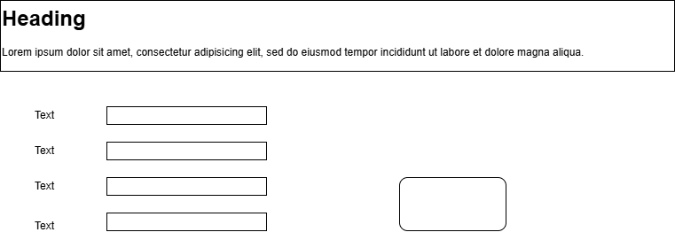

# スカウト文作成・承認ワークフローシステム  
# 基本設計書（High Level Design）

## 画面設計
### 画面レイアウト
### 画面遷移
### 画面入出力項目一覧

## データモデル
### ER図

## 外部インターフェイス


# サンプルドキュメント

## 1. 概要
このドキュメントは、Markdownの基本的な書き方を示すサンプルです。

---

## 2. 箇条書き

- 項目1
- 項目2
- 項目3

---

## 3. 番号付きリスト

1. ステップ1
2. ステップ2
3. ステップ3

---

## 4. 表

| 項目名 | 内容 |
|--------|------|
| 名前 | サンプル |
| 種類 | テスト |


---

## 5. コードブロック

```javascript
console.log("Hello World");
```

